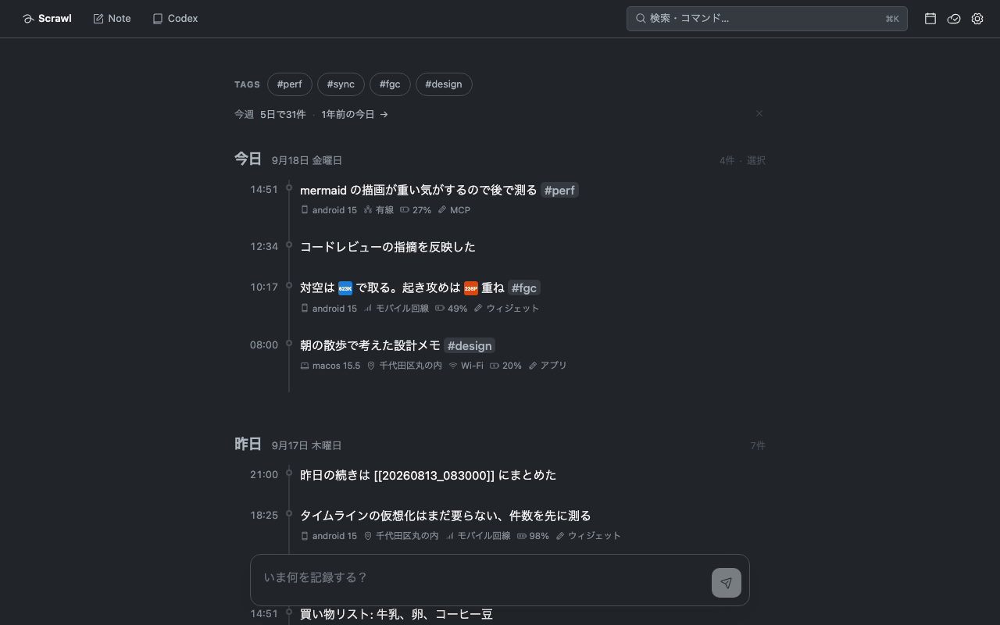
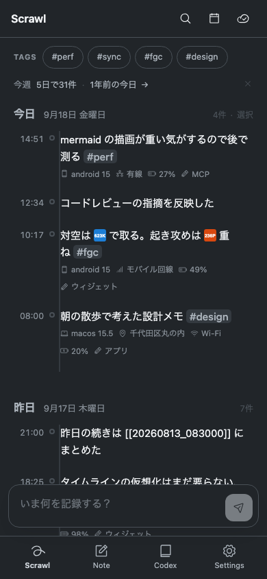
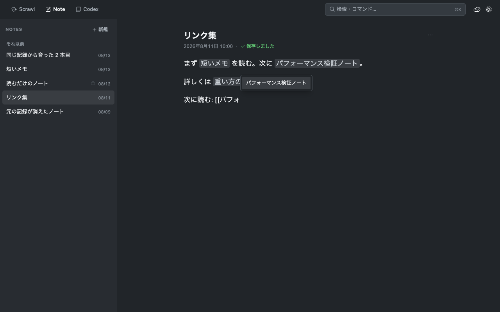
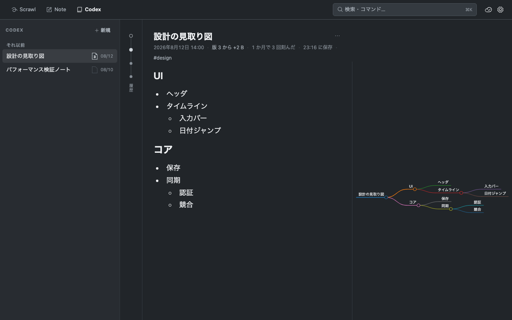
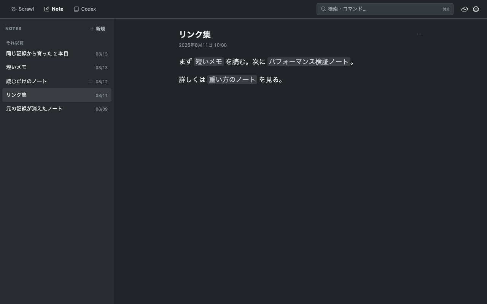
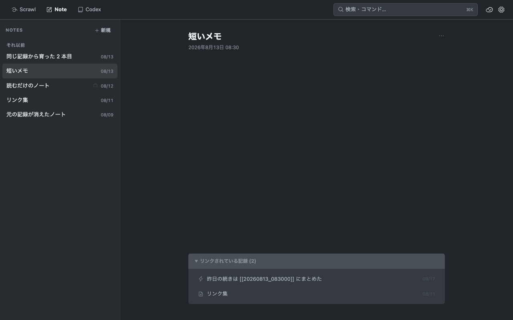
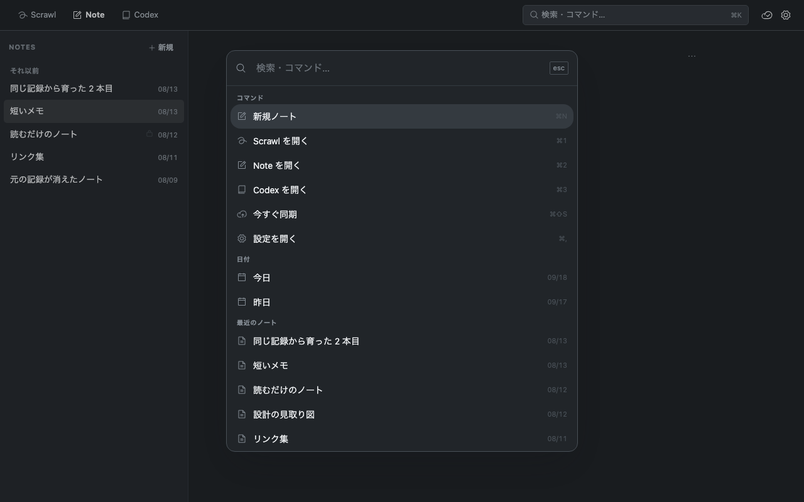

# Feature Tour

A walkthrough of every surface in Magical Merchant. Screenshots are taken
from the browser verification harness with fixture data.

## Timeline — a journal that captures first

The Timeline is a single-column, day-grouped journal. The capture bar at the
bottom is always ready: type, send, and the entry lands on today with a
timestamp. Entries record the device context they were written in (device,
network, battery, and a place name resolved from the coordinate), tags typed
as `#tag` become filter chips, and the calendar button jumps to any recorded
day.



At the top, a **weekly digest** appears once per week: how many entries on how
many days, the most used tags (tap to filter), and — when that day has
entries — a jump to _one year ago today_. Dismissing it hides it for the rest
of the week, per device.

### Mobile

The same journal on a phone. Bottom tabs switch between Timeline, Notes and
Settings; the capture bar floats above the keyboard.



### Promote an entry into a note

When a quick capture grows into something bigger, promote it: hover an entry
(PC) or long-press it (touch) and choose ノートにする. A new note opens ready
to write, carrying the entry text and tags. The note's frontmatter records the
origin entry, and the timeline shows a chip (📄 title →) on that day linking
to the note — derived on every render, so reordering or deleting entries never
breaks the link.

## Notes — a Typora-style Markdown workspace

Notes are plain Markdown files. The list pane groups them by date; the detail
pane shows a rendered preview with a **title field** above it. The title is
the note's leading `# heading` — there is no separate title in the
frontmatter, so the file stays readable in any Markdown tool and the heading
can never drift from the title. Press Enter in the field to drop into the
body. **Tap anywhere in the preview to start
editing** — the caret lands on the character you tapped. Saving is automatic
(debounced), and the first content-changing save of a session keeps the
pre-edit body on the device, so ノート情報 → 編集前に戻す can undo an
accidental edit — press it again to swap back.

The ノート情報 panel is also where a note's records live: the creation time
(editable), the tags, the device context it was captured on, and — once the
body has been rewritten at least once — the **update time**. Creation time is
pinned to the filename order, so the update time is the only place a rewrite
shows up. Changing metadata or the view mode is not a rewrite and leaves it
alone.

A note that is done being written can be parked in a **read-only view**
(frontmatter `view: preview`): the same rendered page, except that tapping
the body no longer starts an edit and the title field is fixed. The choice
lives in the file, so it follows the note to every device.



Code blocks are highlighted with Shiki, ` ```mermaid ` fences render as
diagrams, and a per-note **mindmap view** (frontmatter `view: mindmap`) turns
the heading/list structure into a markmap. One button in the note's header
cycles the three views — editor, mindmap, read-only — and shows the icon of
whichever comes next:



## Note links and backlinks

Type `[[` in the editor and an autocomplete popup offers your notes. The
stored form is `[[YYYYMMDD_HHMMSS]]` — the filename is an immutable ID, so
links survive title changes. The editor and preview render links as the
target's current title; click one to open the note. Write
`[[YYYYMMDD_HHMMSS|display text]]` when the title does not fit the sentence —
the link still points at the same note. A link whose target is gone stays
visible as its raw stored form rather than pretending to be a note.



Every note shows the records that link to it — other notes and timeline
entries alike — in a collapsible リンクされている記録 footer. Backlinks are
derived by scanning at read time; there is no index to corrupt or sync.



## Glyphs — your own inline symbols

Some things have no character: fighting-game command notation, a custom
mark, a logo. Register a small PNG or SVG under a short name in
Settings → GLYPHS and write `:name:` anywhere — a note or a timeline entry —
to show it inline, the way an emoji shortcode works. The preview, the
editor and the timeline all render it; the editor shows the source text
again when the caret touches it, so the stored Markdown stays plain text.

Only registered names render: `12:30:45` and an unknown `:foo:` stay as
written, and a shortcode inside a code span or fence is left alone. The
images live under `data/glyphs/` next to the notes, so sync carries them to
every device; a device that has not received an image yet simply shows the
text. Names are lowercase (`a-z 0-9 _ + -`, up to 32 characters) and images
are capped at 256 KB. To register many at once, pick a whole folder (or
several files) — each PNG/SVG is named after its file stem, an existing name
is overwritten, and anything unusable is counted as skipped; files dropped
straight into `data/glyphs/` are picked up as well.

## Search palette

`⌘K` opens the palette. Before you type anything it offers entry points:
recent notes, today/yesterday (only when they have entries), and your most
used tags. Search results highlight the matched text in a context snippet, and
selecting a hit lands exactly — a note opens that note, a timeline hit scrolls
to that day.

Searches can be scoped to tags, from any screen. Every `#tag` you type in the
palette counts as scope rather than text: `#SF6 #ベガ #置き攻め` lists every
note and entry carrying all three tags (AND), and `#sf6 コンボ` looks for
"コンボ" only inside `#sf6`. Tags are matched the way the Timeline chips are,
so `#SF6` and `#sf6` are the same tag. Picking a tag from the entry points adds
it as a chip in front of the input; a chip is removed by clicking it, or with
Backspace in an empty field (last chip first). When the Timeline is filtered
by a tag, `⌘K` opens the palette with that chip already set. Scoped results
show their count, and the empty message names the tags it looked inside.



## Language

The interface speaks Japanese or English. It follows the system language on
first launch and can be pinned either way in Settings → LANGUAGE; the choice
takes effect immediately, without a restart. Place names follow it too: the
OS geocoder is asked in the chosen language, and the cache remembers which
language each answer came from. Only the interface changes — what you wrote
stays exactly as you wrote it, and so do your tags and the coordinates behind
those place names.

On macOS, Settings → WINDOW adds _Start in fullscreen_: the app opens in the
native fullscreen (its own Space, like the green button) from the next launch.

## Sync (optional)

A Cloudflare Worker + R2 backend syncs the Markdown files across devices.
Conflicts keep the local copy and preserve the loser as a
`.sync-conflict-<timestamp>.md` next to the note. See [sync.md](sync.md) for
deployment and the change-detection protocol.

## Android widgets

Three home-screen widgets ship with the APK: a Timeline capture bar (writes
through JNI without launching the app), a "new note" bar, and a recent notes
list that deep-links into the app.

## Terminal (CLI)

`magical-merchant` is a small command-line client over the same core, for
the days you would rather write in your own editor:

```sh
nix run github:Xantibody/magical-merchant#cli -- list
magical-merchant show                  # the newest note
magical-merchant edit 20260320_143045  # opens it in $VISUAL / $EDITOR
magical-merchant edit --last           # the newest note; `edit` never guesses
echo "# Idea" | magical-merchant new   # or: magical-merchant new --title Idea
magical-merchant timeline add -m "shipped it #work"   # capture; without -m, opens the editor
magical-merchant timeline show [2026-03-20]           # one day, today if omitted
```

`edit` hands the editor the Markdown body only — the frontmatter is the
app's record and is never shown — and writes it back through the same path
the MCP tools use: a copy of the previous version goes to `history/` first,
and the write is refused if the note changed while the editor was open (in
the app, by a sync, by an agent). Nothing typed is lost: the edited text
stays in a scratch file whose path is printed. Closing the editor without
changes writes nothing. The app, in turn, refuses to overwrite a note the
CLI changed while it was open, reloads it, and keeps the typed text behind
its Revert button.

`timeline add` appends to today through the same core call the Android
widget uses; it only ever appends, so it needs no revision check. `-m` is
the one-liner, a pipe is read as the entry, and with neither the editor
opens.

The CLI finds the app's data directory on its own; `--data-dir` or
`MAGICAL_MERCHANT_DATA_DIR` overrides it.

## AI access (MCP)

`magical-merchant mcp` exposes the same core as read-only
[Model Context Protocol](https://modelcontextprotocol.io/) tools for AI
assistants; `nix run …#mcp` is that command. It finds the app's data
directory on its own, so the usual client configuration is just the launch
command:

```json
{
  "mcpServers": {
    "magical-merchant": {
      "type": "stdio",
      "command": "nix",
      "args": ["run", "github:Xantibody/magical-merchant#mcp"]
    }
  }
}
```

Every record comes back with the device state captured when it was
written — local time, GPS coordinates (and the place name the app resolved
for them), battery, network type, and which device wrote it — so an agent
can line the journal up with other time- or location-based data.

| Tool                  | Description                                                         |
| --------------------- | ------------------------------------------------------------------- |
| `list_notes`          | List all notes with tags, a short preview, and their origin         |
| `read_note`           | Read a note's metadata (time, tags, context) and Markdown body      |
| `backlinks`           | List the records that link to a note with `[[…]]`                   |
| `search`              | Search notes and timeline entries, optionally within a set of tags  |
| `list_timeline_dates` | List the dates that have timeline entries                           |
| `read_timeline`       | Read one day's entries with time, text, tags, location, and device  |
| `read_timeline_range` | Read entries between two days, optionally filtered by tag           |
| `list_places`         | Places (~1 km cells) records were written at, with names and counts |
| `list_tags`           | Every `#tag` with note and entry counts                             |
| `list_templates`      | List note templates                                                 |
| `read_template`       | Read a template's body and tags                                     |
| `list_glyphs`         | Registered glyphs with the `:name:` shortcode that renders each one |

With `--allow-write` the server also offers writing tools. Notes are
plain Markdown, so a body can hold anything the app renders — Mermaid
diagrams in a fenced `mermaid` block, `[[YYYYMMDD_HHMMSS]]` links to other
notes, `#tags`, `:name:` glyph shortcodes (ask `list_glyphs` for the
vocabulary). The server writes the frontmatter itself and keeps it intact
on updates; the body is all a client sends.

Every overwrite first saves a full copy of the previous version under
`<data-dir>/history/` (outside the synced `data/`), so any change an
assistant makes can be brought back. `read_note` also returns a `revision`
of the body; pass it to `update_note` and the write is refused if the note
changed in between (in the app, from the CLI) instead of overwriting that
edit:

| Tool                | Description                                                          |
| ------------------- | -------------------------------------------------------------------- |
| `create_note`       | Create a note from a Markdown body (first line `# Title`)            |
| `update_note`       | Replace a note's body, optionally only if its `revision` still holds |
| `list_note_history` | List the saved copies of a note, newest first                        |
| `read_note_history` | Read the body of one saved copy                                      |
| `restore_note`      | Bring a note back to a saved copy (the current version is saved too) |
| `save_glyph`        | Register or replace a glyph image (png/svg, base64, up to 256 KiB)   |

| Flag / variable                                  | Description                                                         |
| ------------------------------------------------ | ------------------------------------------------------------------- |
| `--data-dir` / `MAGICAL_MERCHANT_DATA_DIR`       | Override the data directory (default: the app's own data directory) |
| `--locale` / `MAGICAL_MERCHANT_LOCALE`           | Preferred language for place names, `ja` or `en` (default `en`)     |
| `--allow-write` / `MAGICAL_MERCHANT_ALLOW_WRITE` | Offer the writing tools (off by default)                            |

Timeline times are the recording device's local wall-clock time without a
UTC offset; note times are RFC 3339 with the offset. Place names come from
the app's own geocoding cache — the server never calls a network service.
