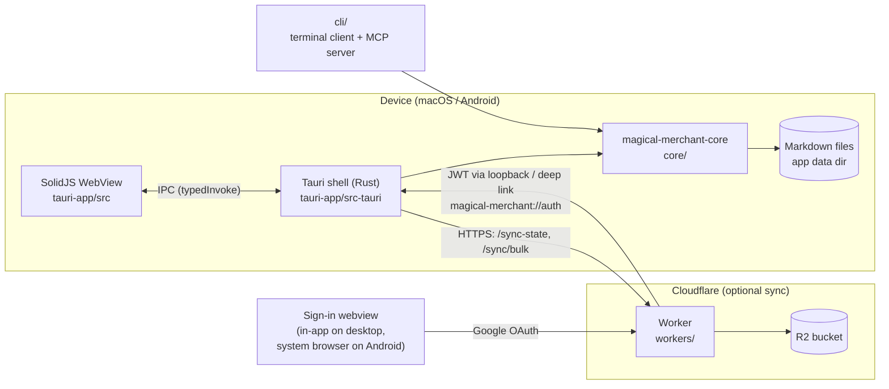
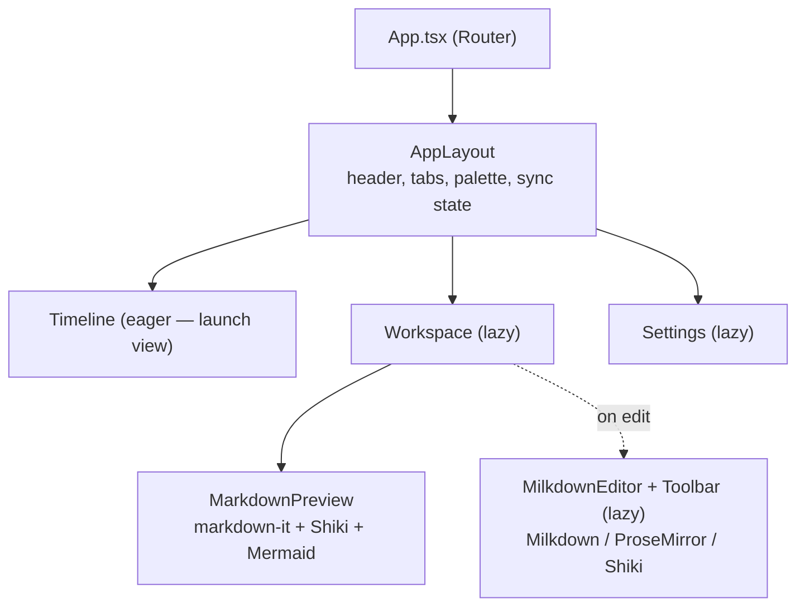
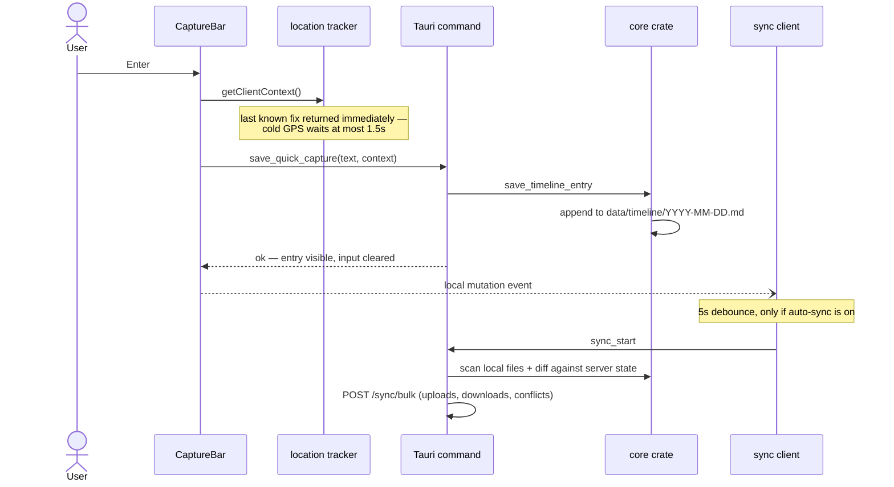

# Architecture

Magical Merchant is a local-first note-taking app. Every save is a plain
Markdown file written to the device; the network is only involved when the
optional background sync runs. This page maps the moving parts and the
decisions behind them.

Other guides: [Feature tour](features.md) ·
[Development](development.md) · [Install](install.md) ·
[Sync backend](sync.md)

## System overview



Three consumers share the same core crate: the desktop/mobile app, the
`cli/` binary (a terminal client that opens notes in `$EDITOR`, and the MCP
server behind `magical-merchant mcp`), and the benchmarks. The core knows
nothing about Tauri, HTTP, or the UI — it takes a base directory and works
on files.

Because three writers can touch the same note, every body write goes
through one core function that takes the revision the writer read. A write
whose revision no longer matches is refused; the app then reloads and keeps
the typed text behind Revert, the CLI keeps it in a scratch file.

## Key design decisions

- **Local-first saves.** A capture or an edit never waits on the network.
  Sync is a separate, debounced background step; if it never runs, the app
  is still fully functional.
- **Plain Markdown on disk.** The store is human-readable files, one per
  note and one per timeline day. There is no database to migrate or corrupt;
  sync and search operate on the same files the user could read themselves.
- **Framework-independent core.** All business logic (timeline, notes,
  search, sync diffing) lives in `core/` so the Tauri shell stays a thin
  command layer and the same logic serves the MCP server.
- **Server-authoritative sync state.** The client never constructs the sync
  state it sends back; it stores what the server confirmed. Conflicts are
  resolved local-wins, with the losing side kept as a `.sync-conflict-*`
  copy so no edit is ever silently dropped.

## On-disk layout

```
<app data dir>/
├── data/                      # everything under here syncs
│   ├── timeline/
│   │   └── 2026-08-09.md      # one file per day, entries appended
│   └── notes/
│       └── 20260809_143000.md # one file per note, frontmatter + body
├── history/                   # copies taken before CLI / MCP overwrites (newest 20 per note)
├── .sync-state.json           # what the server last confirmed
└── sync-config.json           # Workers URL, auto-sync flag (shared with the CLI)
```

A timeline day file lists the devices used that day once in its
frontmatter; each entry line carries a time prefix and a trailing JSON
context (battery, network, location) that references the device list by
index. Reading expands entries back to self-contained lines, so callers
never see the on-disk compression.

## Frontend structure



The timeline is the launch view, so everything the editor drags in
(Milkdown, ProseMirror, Shiki) is split out of the startup bundle and
prefetched during idle time. All Tauri commands go through `typedInvoke`
(`lib/commands.ts`), which types every command and notifies listeners on
each successful mutation — that single hook drives auto-sync scheduling.

## Quick capture flow



The save path never blocks on the network or on a GPS fix: coordinates come
from a warm cache that refreshes in the background, and sync happens after
the entry is already on disk.

## Module index

| Path                                                 | Responsibility                                                             |
| ---------------------------------------------------- | -------------------------------------------------------------------------- |
| [`core/src/timeline/`](../core/src/timeline)         | Day-file parsing, appends, edits; device-list frontmatter compression      |
| [`core/src/note/`](../core/src/note)                 | Note CRUD and list summaries (frontmatter + preview + tags)                |
| [`core/src/search.rs`](../core/src/search.rs)        | Substring search across timeline and notes                                 |
| [`core/src/sync/`](../core/src/sync)                 | Local scan + hashing, diff against server state, conflict naming           |
| [`tauri-app/src-tauri/`](../tauri-app/src-tauri/src) | Tauri commands, sync HTTP client, OAuth deep-link handling, device context |
| [`tauri-app/src/`](../tauri-app/src)                 | SolidJS views, Milkdown editor integration, client-side device signals     |
| [`workers/`](../workers/src)                         | Cloudflare Worker: Google OAuth, JWT, R2-backed bulk sync with ETag CAS    |
| [`cli/`](../cli/src)                                 | Terminal client (`list` / `show` / `edit` / `new`) and the MCP server      |

> [!NOTE]
> UI priorities (simple → lightweight → stylish), the Milkdown plugin
> policy, and editor performance constraints are defined in
> [`CLAUDE.md`](../CLAUDE.md) and apply to every UI change.
