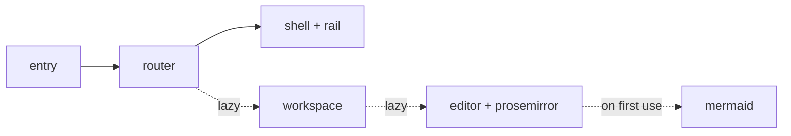

# Measuring the startup bundle

The number that matters is the gzipped `assets/index-*.js` plus `web-*.js`
after a production build. Anything else flatters the result.

```bash
pnpm build
gzip -c dist/assets/index-*.js | wc -c
```

Where the weight comes from:



The lazy edges are the whole design: opening the app must not pay for the
editor, and opening a note must not pay for diagrams.
